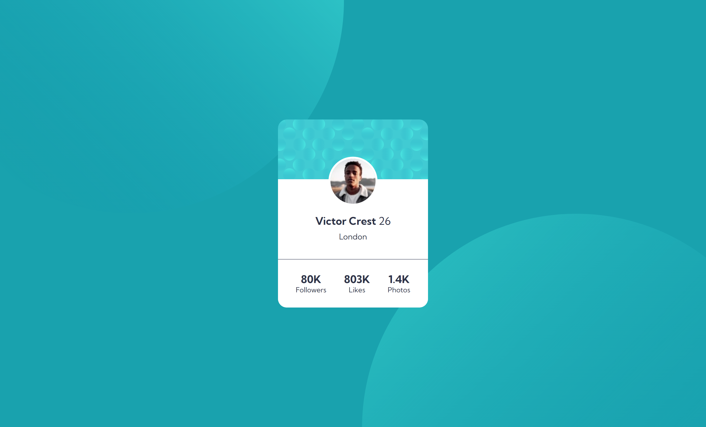

# Frontend Mentor - Profile card component solution

This is a solution to the [Profile card component challenge on Frontend Mentor](https://www.frontendmentor.io/challenges/profile-card-component-cfArpWshJ). Frontend Mentor challenges help you improve your coding skills by building realistic projects. 

## Table of contents

- [Overview](#overview)
  - [The challenge](#the-challenge)
  - [Screenshot](#screenshot)
  - [Links](#links)
- [My process](#my-process)
  - [Built with](#built-with)
  - [What I learned](#what-i-learned)
  - [Continued development](#continued-development)
  - [Useful resources](#useful-resources)
- [Author](#author)

## Overview

### The challenge

- Build out the project to the designs provided

### Screenshot



### Links

- Solution URL: [https://github.com/ozanweb/profile-card-component-main]
- Live Site URL: [https://ozanweb.github.io/profile-card-component-main]

## My process

### Built with

- Semantic HTML5 markup
- CSS
- CSS Flexbox
- CSS Resets (Source is below)
- Google Fonts

### What I learned

- It is possible to add two different background in one element.
- I have noticed that ```overflow: hidden``` doesn't work when the ```vw``` and ```vh``` units are used determining the width or height of the elements.

### Continued development

- Mastering CSS flex properties further

### Useful resources

- [CSS Resets](https://piccalil.li/blog/a-modern-css-reset/) - This helps you if you really want to start from scratch.

## Author

- Frontend Mentor - [@ozanweb](https://www.frontendmentor.io/profile/ozanweb)
- LinkedIn - [@ozanpalanci](https://www.linkedin.com/in/ozanpalanci/)

